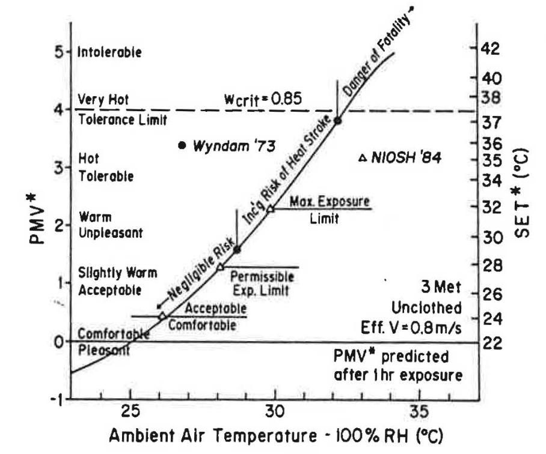
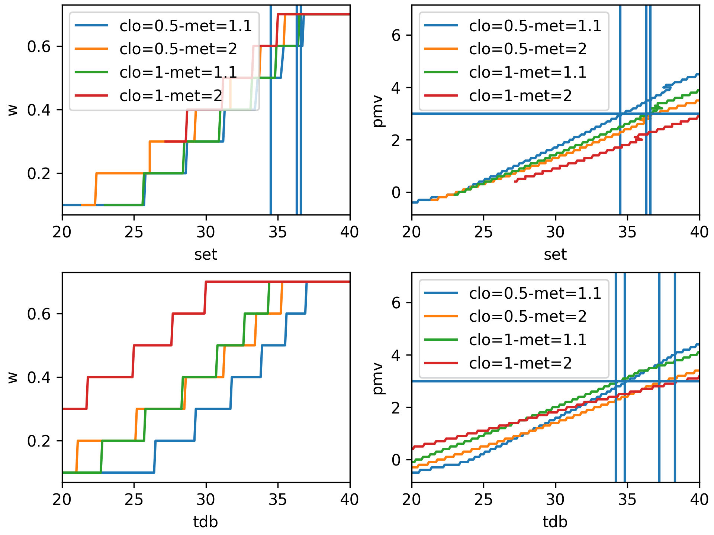
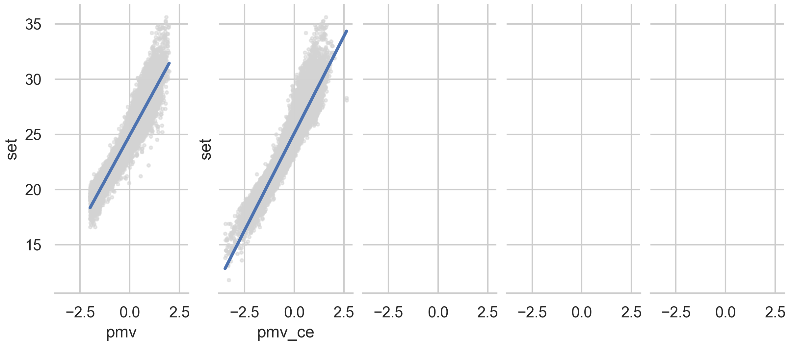

# Summary results

* the PMV model is kind of okay, but the SET or PHS model are even better. We should use them instead of the PMV model.
* the thermal sensation scale and the PMV results are two different scales and are not comparable. The former is for thermal comfort and the latter is for thermal stress. See w values. See value of w for PMV of 3 or Gagge's paper.
```python
pprint(two_nodes(tdb=35, tr=35, v=0.1, rh=50, met=1.1, clo=0.5))
{'_set': 34.7,
 'et': 35.0,
 'pmv_gagge': 3.0,
 'pmv_set': 2.9,
 'w': 0.5}
pprint(pmv(tdb=35, tr=35, vr=0.1, rh=50, met=1.1, clo=0.5, standard="ASHRAE"))
3.3  # also 3.3 with ISO
```

* I am not sure about the classification issue, precision vs recall and false positive and false negative. SMOTE reduce false negatives at the cost of increasing false positive. Maybe better not to use it.
* The assumption -1, 0, 1 thermal sensation comfortable is incorrect, see chart comparison thermal preference
* the database II inherently contain a lot of issues, see simply as a small change in met or clo affects the results. As I show in the COBEE paper
* Personalized comfort models may be used in operational settings but the SET model should be used in design phase
* SET cooling effect is not based on any scientific evidence
* SET is simple enough to calculate that there is no reason to use a simpler model. Shall we make an API?
* the building type and natural ventilation concept as little impact. If I put you blindfolded in a room you cannot tell the building type in which he is in. If there is an effect only personal comfort models can depict it since basically each one of us see the world with his how eyes and its is hypotalamus that regulates its temperature. People have no clue about building type, it is absurd that we assume they vary their thermal perception based on the building type.
* it is incorrect to use the dry-bulb temperature as predictor, see chart
* maybe we should define a new SET in which we also standardize met and clo
* SET to predict comfort and heat stress
* create a model that compares SET vs thermal preference, I am not sure SET defines clothing as a function of MET and it is not consistent
    * a model for thermal preference vs w (skin wettedness) for wanting to be cooler?
    * a model for thermal preference vs cold signal (vasonctriction) for wanting to be warmer?


## Comfort DB overview

The dataset contains mainly:
* temperature data between 20 and 27C.
* RH between 30 and 70 %.
* V lower than 0.2 m/s
* Met lower than 1.5 met


* Age is not normally distributed with more votes from younger adults
* Running mean temperature is also skewed with mainly warm data


The dataset is not well-balanced, most of the people reported to be thermally `neutral`.

The great majority of the participants voted `no change` when thermally `neutral`. 
Thermal preference can be easily used to predict `hot` or `cold`.
The great majority of the people who reported to be `slighlty warm` or `slightly cold` wanted to be `cooler` and `warmer`, respectively.


> SMOTE it is used to tweak the model to reduce false negatives at the cost of increasing false positive. For example, we will better detect who is hot but at the same time we will also increase the number of people who are in fact hot but are predicted to be comfortable. SMOTE generally increase recall, but decreases precision. For example a model that always predict hot has a good recall but a low precision.

## Preliminary PMV model comparison

### Prediction accuracy
* All models can only accurately predict the thermal sensation of thermally `neutral` people.
All models failed to predict thermal discomfort.
* ATHB model performed best followed by the PMV Gagge.
> while both the above-mentioned models had a higher accuracy in detecting people who reported to be thermally `neutral` this results could be deceptive since a model who always predict `neutral` will lead to a higher accuracy. 

* The ATHB model which tent to predict `neutral` under every condition.
* The ATHB chart comprises a smaller number of data-points since not all the studies measured running mean outdoor temperature.


This plot shows on the x-axis the predicted PVM value while the stacked bar plot shows the number of thermal sensation votes recorded for the PMV binned. We are also reporting the number of points per bin.
Even in this scenario only for PMV = 0 results are `satisfactory`.


#### Thermal sensation f1-micro

**F1 score definition** The F1 score can be interpreted as a harmonic mean of the precision and recall, where an F1 score reaches its best value at 1 and worst score at 0.
Precision (also called positive predictive value) is the fraction of relevant instances among the retrieved instances, while recall (also known as sensitivity) is the fraction of relevant instances that were retrieved.
- `micro` calculate metrics globally by counting the total true positives, false negatives and false positives.
- `macro` calculate metrics for each label, and find their unweighted mean. This does not take label imbalance into account.
- `weighted` calculate metrics for each label, and find their average weighted by support (the number of true instances for each label). This alters ‘macro’ to account for label imbalance; it can result in an F-score that is not between precision and recall.

|          |      pmv |   pmv_ce |   pmv_set |   pmv_gagge |     athb |   pmv_toby |
|:---------|---------:|---------:|----------:|------------:|---------:|-----------:|
| micro    | 0.33595  | 0.34124  |  0.382199 |    0.391962 | 0.418915 |   0.375858 |
| macro    | 0.152728 | 0.155519 |  0.130147 |    0.130317 | 0.13544  |   0.17403  |
| weighted | 0.297244 | 0.29656  |  0.296015 |    0.299774 | 0.312856 |   0.312435 |

#### Predicted vs reported thermal preference
Thermal preference was calculated considering -0.5 < PMV < 0.5 satisfactory.
On the x-axis I am showing the reported thermal preference while on the y-axis the percentage of time the PMV correctly predicted thermal preference.


### Regression

The LOWESS line of some models do not pass through the center point.
The slope of the line is low.


### Overall bias

In red the values that are between -0.5 and 0.5. 
The text reports the mean and standard deviation of the distribution. 
Same analysis as Humphreys et al. (2002)

> PMV is free from serious bias, same conclusion as Humphreys et al. (2002)


### Bias per model vs each variable

The following Figures show the value of PMV - TSV binned by different variables.
The value on the x-axis is the middle point of the bin.

#### Temperature
* PMV Gagge, SET, or ATHB much better than PMV and PMV-CE for common air temperatures.
* PMV model lower applicability limit may need to be changed to 16 C.
* For t-r higher than 33 the model does not work well. Recommend to use same limits for t-db and t-r
* For low t-r results are mixed.
* PMV and PMV-CE t-o bias are very bad. PMV Gagge, SET, and ATHB are better for the `center` range. But still bad at the extremes
* Various results with running mean outdoor temperature

#### Airspeed
* PMV-CE perform worse than PMV at higher airspeeds
* For airspeed bias PMV SET or ATHB are better

#### RH
* RH quite bad results for PMV and PMV-CE. Other models perform better in the `central` range but worse in edge conditions.

#### Clo
* PMV and PMV had bad results for low and high clo values.

#### Met
* PMV very bad for met higher than 2.5 met

#### TS and TP
* All model are very bad aside for TSV = 0

#### PMV models comparison
* ATHB has less bias towards different PMV values, while other models are okay only for central categories or PMV between 0 and 1.


## Formulaic error

The following scatter plot illustrates the formulaic error between the SET and the various PMV models.
Since both the SET and PMV models use the same inputs, the delta is only caused by the difference in the formulation of both models.
Analysis from Humphreys et al. 2000.



# Main issue with the PMV

From the above mentioned analysis it looks like the PMV is accurate enough to estimate thermal neutrality.
The issue arises when we move away from thermal neutrality.
The PMV tries to find a correlation between heat losses/gains from a cylinder to the environment and thermal sensation.
This is problematic since in most conditions of mild thermal discomfort the body it is still in equilibrium withe environment.
Albeit it is taking some actions to compensate for the instability (sweating, vasoconstriction, vasodilation).
Moreover the correlation between PMV and heat losses is based solely on a few datapoints collected by Nevis et al.
The PMV is based on a study which determined the correlation between TSV and T for four activity levels.
Clothing were kept constant.
A correlation between TSV and T was found and by substituting this new equation in the PMV model a correlation between TSV and L can also be found.
This correlation is assumed to be constant which is already the first main possible issue.
These data were then used to determine a correlation between PMV and L (heat losses) as a function of metabolic rate.

# TODO
* plot heat losses (L) vs thermal sensation and preference
* calculate w for PMV=3
* PMV model is less accurate than the SET
* SET cooling effect is not based on any scientific evidence
* it is better a false negative then a false positive (e.g. if comfortable is classified as hot then we consume more energy and adjust setpoint, if hot is classified as comfortable we do not act on)

# COBEE conference paper
We simulated how the PMV values vary as a function of an error in the measurement. This was done by randomly selecting 1000 points from a normal distribution (shown in Figure 5) and then using them to calculate the PMV. The Figure 5Figure shows that despite the limited uncertainties in the inputs in approximately 50% of the cases the model predicted a ‘neutral’ thermal sensation while in the other half ‘slightly warm’. This further highlights that binning PMV values may significantly lower its prediction accuracy. Finally in this paper we compared the predicted PMV valuesotes with individual TSV. However, the PMV model was originally designed to predict the average thermal sensation of a group of occupants sharing the same thermal environment, instead of and not individual votes. The Comfort DB, however, does not containscontain detailed information about where the survey was conducted, and consequentlythus, we could not are unable to group people and calculate their average TSV.

![](./figures/COBEE.png